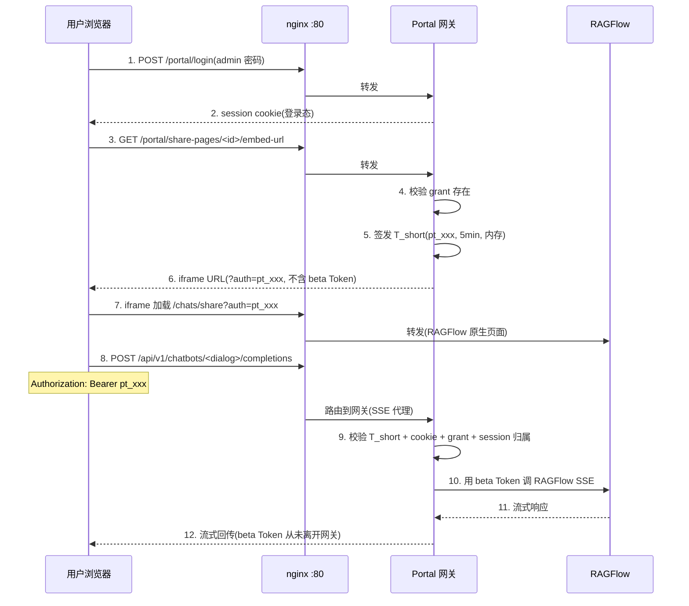
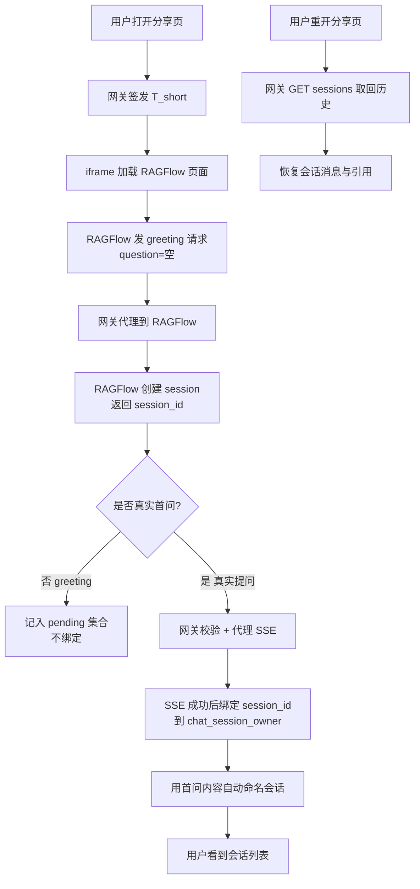

# Portal Extension 产品白皮书

> RAGFlow 权限控制门户 — 在 RAGFlow iframe 嵌入方案之上,增加权限控制层,
> 解决企业落地的三大阻碍:租户 Token 泄露、会话丢失、缺用户审计。
>
> 本文档自含产品定位与核心技术原理,容器/路由/代码结构等技术参考细节见
> [architecture.md](../architecture.md),API 签名见 [api.md](../api.md),
> 表结构见 [data-model.md](../data-model.md)。

---

## 1. 背景与问题

### 1.1 RAGFlow iframe 嵌入方案

RAGFlow 提供 iframe 嵌入能力,让企业把对话能力嵌入到自己的门户或业务系统中。
典型用法:管理员在 RAGFlow 中创建一个 Chat(dialog),生成一个包含
`shared_id`(即 dialog_id)和 `auth`(即租户 API Token,又称 beta Token)的
分享 URL,业务页面用 `<iframe src="...">` 加载这个 URL,用户即可与 RAGFlow
对话。

这套方案在 POC 阶段足够用,但进入企业生产环境时,暴露三个结构性问题。

### 1.2 问题一:租户 Token 泄露风险

RAGFlow iframe URL 里的 `auth` 参数是**租户级 API Token**(beta Token)。
这个 Token 一旦泄露,持有者可以访问该租户的**全部资源**——不仅限于这个 dialog,
还包括同租户下的所有知识库、所有对话、所有文档。

泄露途径:
- URL 会出现在浏览器地址栏、访问日志、CDN 日志、运维监控系统
- 用户可以右键查看 iframe 源码,直接拿到 `auth` 参数值
- 截图、分享链接都可能携带 Token

对于一个承载了企业内部知识库的 RAGFlow 实例,这意味着任何能打开分享页的用户,
都拿到了访问全部知识库的钥匙。

### 1.3 问题二:用户无法管理历史会话

RAGFlow 的 Chat iframe 把会话存在 `API4Conversation` 表中,这个表与 RAGFlow
官方 Chat API 用的 `Conversation` 表**不互通**。后果是:

- 用户在 iframe 里对话,关闭页面后会话"丢失"——不是真的删了,而是门户层面
  没有记录这个 session_id 属于哪个用户
- 用户无法看到自己的历史会话列表,更不能重命名、删除
- 管理员无法知道哪个用户在什么时候问了什么

本质问题:RAGFlow 只知道"有个 session_id 被创建了",但不知道"这个 session
属于门户里的哪个用户"——缺少一个归属映射层。

### 1.4 问题三:缺乏用户/角色/审计能力

RAGFlow 的 `tenant` 是资源租户概念(谁拥有这些知识库),不是用户管理概念。
企业生产环境需要的用户管理能力,RAGFlow 不提供:

- 企业级账号体系(不是 RAGFlow 租户,而是企业自己的员工账号)
- 角色与权限(谁能访问哪个分享页、谁能进入管理后台)
- 用户组(按部门/项目批量授权)
- 审计日志(谁在什么时候登录、授权、删除会话、改了密码)
- 管理员后台(可视化创建用户、授权、查看审计)

没有这些能力,企业无法把 RAGFlow 作为正式的内部工具交付使用。

---

## 2. 解决方案:同源架构

### 2.1 核心思路

不重写 RAGFlow 的聊天 UI,而是在 RAGFlow iframe 之上增加一层**权限控制门户**,
解决令牌泄露、会话归属、用户审计三个问题。三层架构,同源部署:

```
┌─────────────────────────────────────────────────────────┐
│                     浏览器(同源)                         │
│  ┌───────────┐  ┌──────────────┐  ┌──────────────────┐  │
│  │ 门户 UI    │  │ RAGFlow iframe│  │ 门户 session cookie│  │
│  │(登录/管理) │  │ (原生聊天 UI) │  │  (HTTP-only 签名) │  │
│  └─────┬─────┘  └──────┬───────┘  └────────┬─────────┘  │
│        │               │                    │            │
└────────┼───────────────┼────────────────────┼───────────┘
         │               │ (SSE/API 经 nginx)  │
         ▼               ▼                    ▼
┌─────────────────────────────────────────────────────────┐
│              nginx :80(同源入口)                         │
│  /portal/*  → portal uvicorn(权限门户 + 网关)            │
│  /api/v1/chatbots/*/completions → portal(SSE 代理)      │
│  /api/v1/chatbots/*/sessions/*   → portal(会话管理)      │
│  /*         → RAGFlow 容器(原生页面与静态资源)            │
└─────────────────────────────────────────────────────────┘
         │
         ▼
┌─────────────────────────────────────────────────────────┐
│  portal uvicorn :8000(权限门户进程)                      │
│  ┌──────────┐  ┌──────────┐  ┌───────────┐              │
│  │ 权限门户  │  │ 嵌入网关  │  │  令牌存储  │              │
│  │(用户/授权 │  │(代理/校验)│  │(T_short)  │              │
│  │ /审计)    │  │           │  │  (内存)   │              │
│  └─────┬────┘  └─────┬────┘  └───────────┘              │
│        │             │ 用 beta Token 调                   │
│        ▼             ▼                                    │
│  ┌──────────────────────────┐                             │
│  │   RAGFlow bot_api(:8080) │  ← 真实 beta Token 只在此处使用
│  └──────────────────────────┘                             │
└─────────────────────────────────────────────────────────┘
```

### 2.2 同源的关键意义

门户与 RAGFlow iframe 在**同一个 origin** 下部署(都经 nginx :80 对外)。
这是整个方案能成立的基石:

- iframe 同源加载时,浏览器自动携带门户的 session cookie——网关据此校验登录态
- iframe 内的 API 请求(SSE、会话管理)走 nginx,被路由到 portal 网关,
  网关在代理前执行完整校验链
- 不需要跨域配置(CORS),不需要 postMessage 通信,iframe 内 RAGFlow 前端
  对令牌注入和代理完全无感知

如果门户和 RAGFlow 跨域部署,iframe 内的 cookie 不会自动携带,网关无法校验
登录态,整个安全模型失效。

---

## 3. 技术原理

### 3.1 令牌隔离:beta Token 不离开网关

RAGFlow 的租户 Token(beta Token)是访问全部资源的根钥匙。
Portal Extension 的核心安全原则:**beta Token 全程只在网关→RAGFlow 这一跳出现,
绝不返回浏览器**。

机制:
1. 网关在启动时从环境变量读取 beta Token,存在内存中(不写文件、不返回任何 API)
2. 用户登录 + 授权校验通过后,网关**签发短期嵌入令牌 T_short**(随机字符串,
   `pt_` 前缀,默认初始 TTL 5 分钟,内存存储,可撤销;活跃 SSE 请求触发 `TokenStore.touch()` 滑动续期)
3. iframe URL 的 `auth` 参数放 T_short,不放 beta Token
4. iframe 内 RAGFlow 前端的 `getAuthorization()` 原生优先读 URL `?auth=`,
   回退才读 localStorage——因此 RAGFlow 前端拿着 T_short 调 API,以为它是真 Token
5. 网关收到带 T_short 的请求,校验通过后,**替换为 beta Token 调 RAGFlow**,
   响应回传 iframe



### 3.2 T_short 的生命周期与撤销

T_short 不是持久化凭据,而是"用户登录态 + 授权"的**派生凭据**:

- **签发时机**:用户请求分享页 embed-url 时,网关校验 grant 存在后签发,
  绑定到具体用户 + 分享页
- **存活期**:默认初始 TTL 5 分钟(`T_SHORT_TTL_SECONDS` 可配);活跃 SSE 请求触发 `TokenStore.touch()` 滑动续期(沿用签发时 TTL),实际存活时间 = 最后一次活跃请求 + TTL;已撤销或已过期的令牌不能被 `touch` 复活
- **存储**:纯内存,进程重启后所有 T_short 失效——用户重新登录获取新 T_short,
  不丢失任何业务数据(历史会话在 DB,不丢失)
- **撤销**:管理员撤销授权时,网关批量吊销该用户对该分享页的所有 T_short,
  后续请求返回 401/403

撤销授权的完整动作:
1. 删除 `share_page_grant` 记录(DB)
2. 吊销该用户对该分享页的所有未过期 T_short(内存)
3. 后续同 T_short 的请求 → grant 校验失败 → 403(即使 T_short 还没过期)

`pt_` 前缀的设计意义:网关据此区分"portal 签发的 T_short"与"RAGFlow 原生
beta Token"。Portal 重启后 TokenStore 清空,iframe 里残留的旧 T_short(带
`pt_` 前缀)调 API——网关识别为过期 T_short 返回 401(触发重新登录),不会
误透传给 RAGFlow(否则 RAGFlow 不认 pt_ token,返回 109 错误导致前端崩溃)。

### 3.3 网关校验链:SSE 代理的四步安全校验

iframe 内每次 SSE 请求(POST `/api/v1/chatbots/<dialog>/completions`)都经
网关代理,网关执行完整校验链,任一失败即拒绝:

| 步骤 | 校验内容 | 失败响应 | 作用 |
|---|---|---|---|
| 0 | 同源 cookie 有效(门户登录态) | 403 | 未登录用户无法调网关,即使带有效 T_short |
| 1 | grant 存在(用户/组对该分享页有 use 权限) | 403 | 撤销授权后立即失效(即使 T_short 仍有效) |
| 2 | T_short 有效(未过期、未撤销) | 401 | 过期/吊销令牌被拒;校验通过后调 `TokenStore.touch()` 滑动续期,避免长会话中途 401 |
| 3 | session_id 归属当前用户 | 403 | 用户无法用他人 session_id 调网关 |
| 4 | session 的 dialog_id 与分享页一致 | 403 | 防止跨资源 session 混用 |

步骤 1 在步骤 2 之前的设计是刻意的:撤销授权时同时删 grant + 吊销 T_short,
若先校验 T_short(已吊销)会返回 401,与"撤销后应返回 403"的验收要求矛盾。
先校验 grant → 403,保证撤销语义一致。

### 3.3.1 引用资源票据改写:让 `` 不依赖 RAGFlow 登录态

RAGFlow 回答末尾的引用会以 `reference.chunks` 和缩略图形式返回文档资源。其中:

- **非 base64 缩略图路径**(完整 URL 形态 `/api/v1/documents/images/<id>`)由网关改写为带 `portal_ticket` 的同源 URL
- **`reference.chunks[i].image_id`**(裸 ID 形态,非完整 URL)由 `_rewrite_reference_chunk_image_ids` 在 history 响应和 SSE 流中就地改写为带 `portal_ticket` 的形态

`portal_ticket`(前缀 `pit_`)是单图片、不透明、短期凭据,绑定基础 `pt_`、文档 ID、图片 ID,寿命不超过基础令牌。浏览器 `` 不带 Authorization header,凭同源 Portal cookie + 票据取图,网关实时复查 grant 与基础令牌状态。基础令牌撤销或 grant 移除后票据立即不可用。

SSE 流改写依赖 `SSEJSONEventParser.feed_with_raw()` 同时返回 payload 和原始字节:含 image_id 的 payload 改写后用 `_serialize_sse_event()` 重新序列化,无 image_id 的事件透传原始字节(保持逐字节兼容)。

### 3.4 会话归属:解决"会话丢失"

RAGFlow iframe 的会话存在 `API4Conversation` 表,但 RAGFlow 不知道这个 session
属于哪个门户用户。Portal Extension 通过**归属映射表**解决:

- 用户打开分享页时,网关预创建一个空 API4Conversation(发 `question=""` 的
  greeting 请求),从 SSE 首帧解析 session_id
- 真实首问成功后,网关把 session_id 绑定到当前门户用户(写入 `chat_session_owner` 表)
- 用户重新打开分享页时,网关调 RAGFlow GET sessions 取回消息与引用,恢复历史
- 用户看到自己的会话列表(只返回 `portal_user_id` 匹配的记录),重命名/删除
  操作同步到 RAGFlow 两侧



### 3.5 会话双删:门户与 RAGFlow 两侧一致性

用户删除会话时,需要同时删除门户侧的归属记录和 RAGFlow 侧的 API4Conversation:

- **正常流程**:调 RAGFlow DELETE 端点 → 成功 → 门户侧硬删除归属记录
- **RAGFlow 失败**:门户侧标记 `deleted_at`(软删除),不硬删除——归属记录保留,
  供后台重试任务查询并重试删除
- **用户硬删除**:级联删除该用户所有会话,RAGFlow 失败的会话也硬删除门户侧记录
  (避免 `portal_user_id` 指向不存在用户的孤儿记录),RAGFlow 侧残留由管理员手动清理

双删策略保证两侧最终一致:即使 RAGFlow 短暂不可用,门户侧标记待重试的记录会被
后台定时任务重新处理(`RETRY_DELETE_INTERVAL_SECONDS`,默认 5 分钟)。

### 3.6 用户组与授权继承

授权对象可以是**用户**或**用户组**:

- `subject_type='user'`:直接授权给某个用户
- `subject_type='group'`:授权给某个用户组,组内所有成员继承 use 权限

网关校验 grant 时,同时检查用户直接授权和组继承授权,任一存在即通过。
这支持企业常见的"按部门批量授权"场景——创建一个"法务部"用户组,把法务知识库
分享页授权给这个组,新员工加入法务部用户组即自动获得访问权,移除即失去。

### 3.7 多租户隔离(Slice 13)

支持 `org_id` 维度的多租户隔离:

- 每个用户/用户组/分享页/授权/会话/审计日志都有 `org_id` 字段(默认 `default`)
- `is_admin`(平台管理员)可跨 org 操作
- `org_admin`(org 级管理员)只能操作本 org 的资源
- 跨 org 的 grant 不计入授权集合——用户只能访问同 org 的分享页

### 3.8 审计日志:敏感操作全记录

所有敏感操作写入 `audit_log` 表,永久保留,不自动清理:

| 操作类型 | action | 记录内容 |
|---|---|---|
| 登录成功 | `login_success` | 操作者 |
| 登录失败 | `login_failure` | 操作者(含失败原因) |
| 创建授权 | `grant_create` | 操作者 + 分享页 + 授权对象 |
| 撤销授权 | `grant_revoke` | 操作者 + 分享页 + 授权对象 |
| 删除会话 | `session_delete` | 操作者 + 会话 ID |
| 管理员查看会话 | `session_view_elevated` | 操作者 + 目标用户 + 会话 ID |
| 修改用户密码 | `user_password_change` | 操作者 + 目标用户 |
| 启用用户 | `user_enable` | 操作者 + 目标用户 |
| 禁用用户 | `user_disable` | 操作者 + 目标用户 |
| 公开访问 | `public_chat` | 匿名 + 分享页 + 会话(可配置关闭) |

管理员可在后台按操作者、操作类型、时间范围筛选审计日志。

---

## 4. 扩展能力

### 4.1 公开分享页(Slice 15)

分享页可设为 `is_public=true`,允许免登录访问:

- 公开 T_short(`scope='public'`)免 cookie + grant 校验,但每次请求校验
  `is_public` 状态——关闭后立即失效
- 按 IP 限流(每 IP 每分钟 N 次,`PUBLIC_RATE_LIMIT_PER_MIN` 可配)
- 可配置审计开关(`PUBLIC_AUDIT_ENABLED`)

### 4.2 RAGFlow Agent 支持(Slice 16)

除 Chat 类型外,支持 RAGFlow Agent(智能体)类型:

- `ragflow_type='agent'` 走 `/api/v1/agentbots/<id>/completions` 端点
- iframe URL 路径为 `/agent/share`(而非 `/chats/share`)
- 会话管理(预创建/取回/重命名/删除)走 agentbot sessions 端点
- 校验链对 agent 类型同样生效

### 4.3 Widget 嵌入(Slice 16)

支持 widget 类型(`embed_type='widget'`),生成可嵌入任意页面的悬浮组件:

- 独立 HTML 页面 `/widget/<share_page_id>`
- 可复制 iframe snippet 嵌入到外部页面
- 跨域嵌入通过 `WIDGET_FRAME_ANCESTORS` 配置允许的 frame-ancestors 来源
- 其他路径保持 `X-Frame-Options: SAMEORIGIN`

### 4.4 OIDC SSO(Slice 14)

支持 OIDC 协议的 SSO 登录:

- 配置 `OIDC_ENABLED=true` + IdP 连接信息后启用
- SSO 用户首次登录时自动创建本地用户记录(`SSO_AUTO_CREATE` 默认 true)
- SSO 身份(provider + external_id)匹配本地用户,重复登录不创建新账号

---

## 5. 安全模型总结

### 5.1 令牌层级

| 令牌 | 持有者 | 权限范围 | 有效期 | 存储 |
|---|---|---|---|---|
| beta Token | 网关(仅内存) | RAGFlow 租户全部资源 | 永久(管理员手动轮换) | 环境变量,不写文件 |
| T_short | 浏览器(iframe URL) | 单用户 + 单分享页 | 默认 5 分钟(滑动续期) | 网关内存,重启失效 |
| session cookie | 浏览器(HTTP-only) | 门户登录态 | 浏览器会话 | 签名 cookie |

### 5.2 攻击面分析

- **beta Token 泄露**:不可能——只在网关→RAGFlow 这一跳出现,不返回浏览器,
  不写日志,不写文件
- **T_short 被截获**:风险极低——默认 5 分钟初始过期(滑动续期),绑定用户+分享页,撤销立即失效,
  且需配合同源 cookie 才能通过校验链
- **跨用户 session 访问**:被步骤 3/4 校验拦截——session_id 归属校验 +
  dialog_id 一致性校验
- **撤销授权后继续访问**:被步骤 1 校验拦截——grant 删除后即使 T_short 仍有效
  也返回 403
- **禁用用户继续访问**:网关每次请求校验 `user.enabled`,禁用后调网关返回 403
  (会话 cookie 虽在但用户已禁用)

### 5.3 部署安全边界

- 同源部署是硬约束——跨域部署时 cookie 不自动携带,安全模型失效
- `X-Frame-Options: SAMEORIGIN` 防止 iframe 被第三方页面嵌入
- Widget 路径单独配置 `frame-ancestors`,其他路径保持同源限制
- nginx 配置确保 iframe 内 API 请求被路由到 portal 网关(而非直连 RAGFlow)

---

## 6. 延伸阅读

- [architecture.md](../architecture.md) — 容器/进程清单、nginx 路由表、代码目录结构
- [api.md](../api.md) — 完整 API 签名与响应结构
- [data-model.md](../data-model.md) — 数据库表结构与字段说明
- [deployment-and-operations.md](../deployment-and-operations.md) — 部署流程与运维命令
- [configuration.md](../configuration.md) — 环境变量配置项参考
- [admin-manual.md](./admin-manual.md) — 管理员操作手册
- [user-guide.md](./user-guide.md) — 普通用户使用指南
